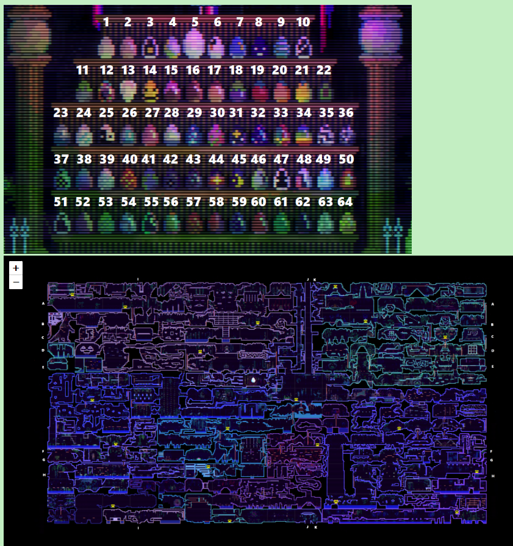
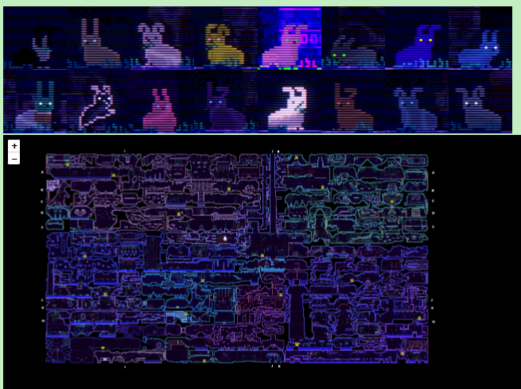
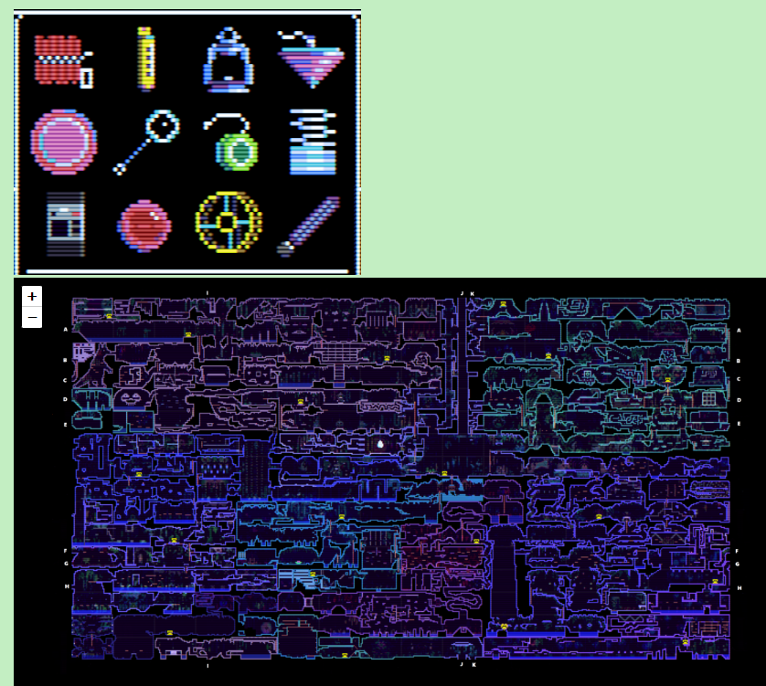

<h1 >动物井参考地图</h1>

<strong>
<samp>

[English](README.md) · [简体中文](README.zh-Hans.md)

</samp>
</strong>

## 项目介绍

这个项目旨在为游戏 “动物井 Animal Well” 提供一个快速的参考地图。它包含游戏中的蛋，兔子，道具，以及一些其他可以参考的东西， 可以通过单击图片的方式快速到达地图的对应位置。

### 背景

我最近玩了动物井这个游戏，发现网上的文章 （techraptor.net）不方便查找目标的对应位置，所以想要做一个可以快速查看的地图。我并没有开发前端的经验，所需的技术 HTML/CSS/JS
都是现学现用，所以成品的效果比较基础，只能保证基本的功能实现，不能称得上是成熟的网页。上述的文章有更多细节，B 站的 up 主 YasuotheHornet 的文章也有解谜的细节。项目中用到
的图片来自游戏的截图，我还制作了一些图标让地图功能得以实现。

这个项目是为了查找的便利， 如果你还没有通关游戏，请尝试自己解决谜题，否则会失去很多游戏乐趣。

我可能会持续改进这个项目，如果有任何疑问/错误/建议可以在 github 相关页面提出。

希望这个项目可以为你游玩动物井这个游戏带来一些便利。

## 功能

- 快速： 单击图片就能跳转地图的对应位置。
- 提供不同内容：蛋，兔子，道具等。
- 使用简单，只是几个页面，浏览器打开即可。
- 地图基于 Leaflet.js

## 快速入门

在子目录 CN_ver 中，直接在浏览器中打开 index_CN.html，有 4 个页面：

主页，包含基本的介绍，以及一个地图，有如下的图层可以选择（通过右上角的图层按钮）：

- 蛋：包含游戏中蛋房间的 64 颗蛋
- 兔子：到达巨兔房间需要找到的 16 只兔子。没有额外的可以用作弊戒指发现的兔子。
- 道具：游戏中道具界面显示的 12 个主要道具。
- 特殊地点：我认为的游戏中比较重要的一些地方。

蛋页：包含一个蛋房间的有 64 颗蛋的图片，可以点击蛋快速到达地图的位置。单击图标有提示。

兔子页：包含 16 只兔子的图片，分成 2 行，分别是兔子空间的左边和右边的 8 个兔子。可以点击兔子快速查找位置，单击兔子图标有提示，下方还有提示信息（隐藏状态），如果需要可以查看。

道具页：包含 12 个主要道具的图片，可以单击跳转。该页面下方也有提示，可以查看。

## 贡献者

我，以及相关文章的作者（我参考了地图的位置以及提示）

## 所用工具

- [Leaflet](https://github.com/Leaflet/Leaflet.git) - 开源轻量的互动地图.

- [Inkscape](https://github.com/inkscape/inkscape) - 开源矢量图片制作
- [Visual Studio Code](https://github.com/microsoft/vscode) - 开源编辑器
- [GNU Image Manipulation Program](https://www.gimp.org/) - 开源图片编辑器

## 许可证

[License MPL](../LICENSE)
